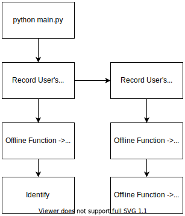
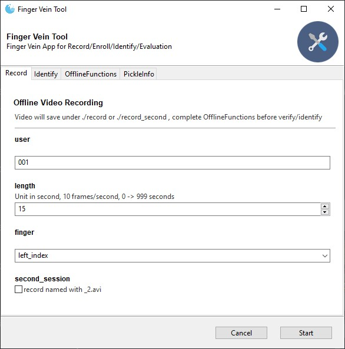
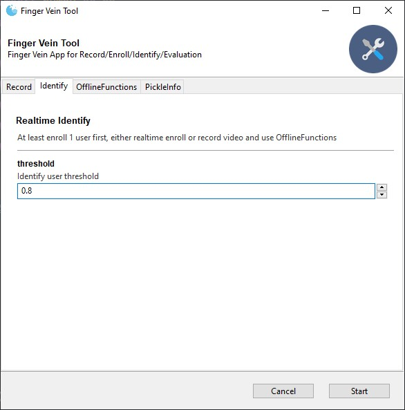
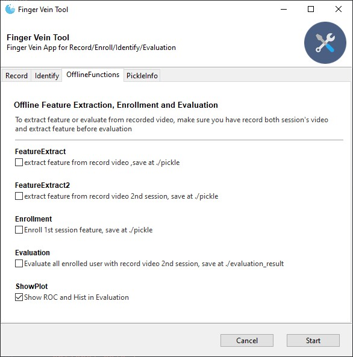
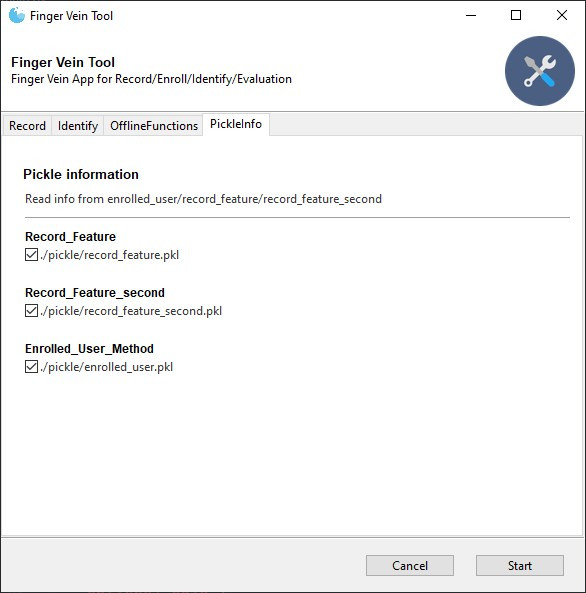
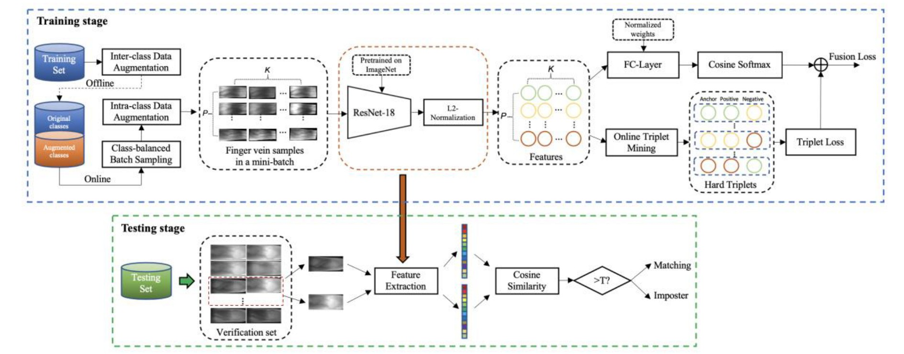

# Finger Vein App

This Finger Vein App is designed for [VS80 Finger Vein Scanner](https://www.futronic-tech.com/pro-detail.php?pro_id=1531). Mainly used for testing different enrolling methods.

---

# Getting Started

## Install Requirements

```bash
pip install -r requirements.txt
```

## Run the App

```
cd fingerveinapp
python main.py
```

## Usage

- Record
- Extract Features
- Offline Evaluation
- Realtime Identify

## Flowchart



## App Content

| Record                   | Identify                 | OfflineFunctions         | PickleInfo               |
| ------------------------ | ------------------------ | ------------------------ | ------------------------ |
|  |  |  |  |

---

# Feature Extraction and Identification Backend

[Fusion Loss and Inter-class Data Augmentation for Deep Finger Vein Feature Learning](https://www.sciencedirect.com/science/article/abs/pii/S0957417421000257)


